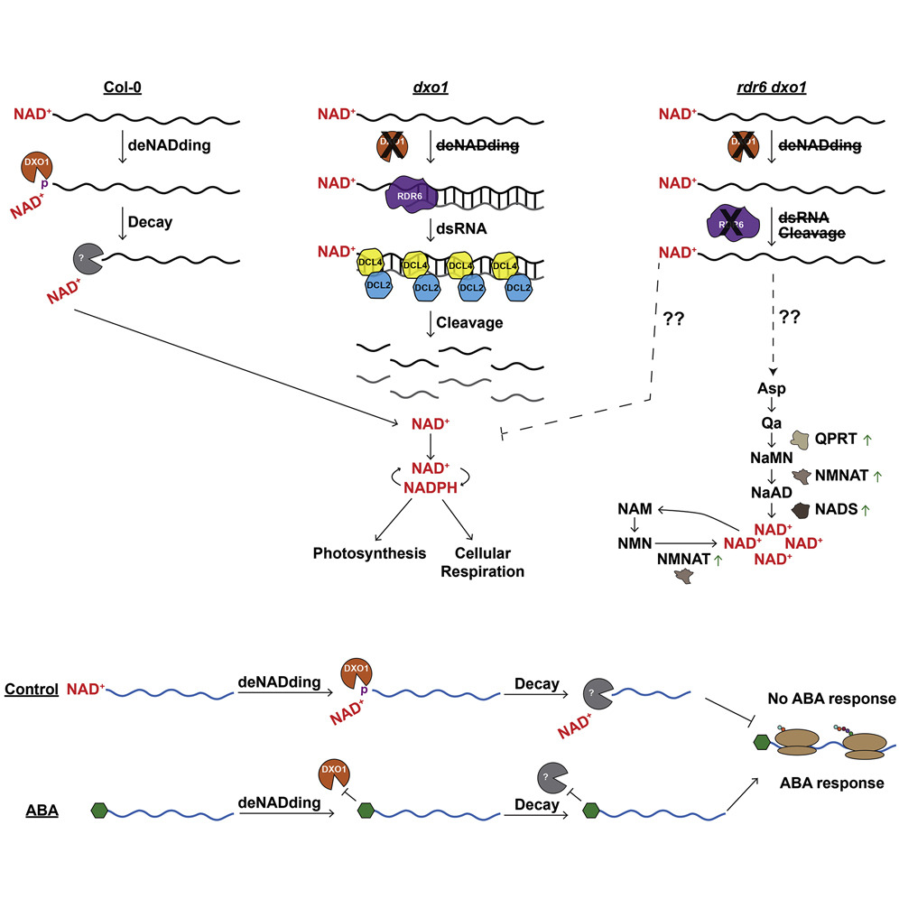
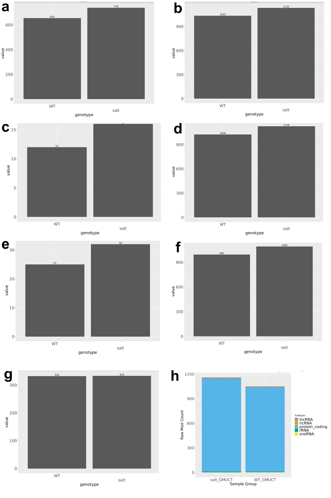
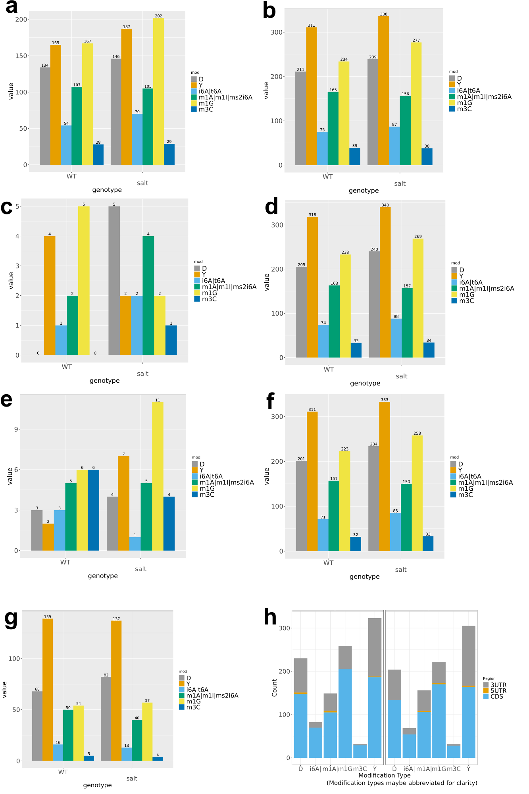
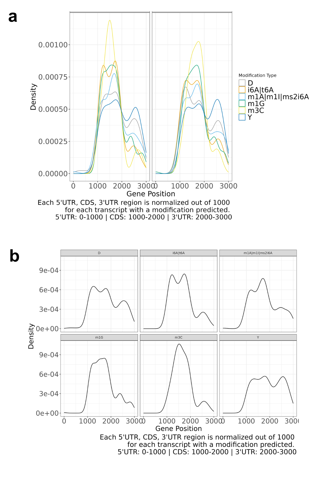

# Tutorial

## Some Notes on Inputs
Please carefully read this section as improper inputs can impact the proper functioning of the software. If you wondered "why did they do this" when running the demo, you should be able to find your answer below. 

### -c
This .csv is the most crucial, as it contains information for how to locate your fastq files, and information for how you want them identified in later visualizations. 

There are 2 columns. Left column is either SRR accession codes, or the file basename of the fastq input directory. If you decide to use SRR code, the entire column must be SRR code; visa versa. If you use SRR accession code, each number must correspond to an existing entry in the [Sequence Read Archive](https://www.ncbi.nlm.nih.gov/sra) database. If you input your own fastq files, the file basenames should NOT include the file suffix like .fq or .fastq.gz in your csv file.

The right column are succinct names for each fastq file. The naming must follow the form: SAMPLE_SEQTECH_REP. Note "_" is the delimiter and is crucial for the program. TREATMENT includes information on variant, genotype, and treatment. SEQTECH is the sequencing method used. REP is the biological replicate number. 

  Example 1: "LemontHeat_mRNA_rep2" = a fastq file generated from mRNA-sequencing replicate 2 of a heat treated Lemont variant O. sativa individual.

  Example 2: "dxo1Salt_GMUCT_rep1" = a fastq file generated from GMUCT sequencing replicate 1 of a salt treated A. thaliana individual with the gene AtDXO1 knocked out.


## Required Dependencies
* Linux-based computer, server, or cluster
* [Docker](https://docs.docker.com/engine/install/)
* Minimum memory of 32 GB and minimum disk space of 120 GB

## Demo Data source
For this tutorial, we'll be using the RNA-Seq data generated by [Yu et al 2021](https://www.sciencedirect.com/science/article/pii/S1534580720308856?via%3Dihub). In this work, they report that Messenger RNA 5′ NAD+ capping is a dynamic regulatory epitranscriptome mark that is required for proper response to abscisic acid in Arabidopsis. A graphic abstract is shown below:

<figure markdown>
  
  <figcaption>Yu et al 2021 article graphic abstract </figcaption>
</figure>

## Pulling HAMRLINC Docker Image
To run HAMRLINC, you need to first pull the docker image for the pipeline to your computer. If you are not familiar with container technology and would like to learn the basics, please check out [CyVerse Container & Cloud Native Camp Documentation](https://cc.cyverse.org/). It is open source and free. Dig in!

Pull HAMRLINC docker image. This should take a few minutes depending on your internet speed.
```
docker pull chosenobih/hamrlinc:v0.3
```
After building the conatiner, run the code below to be sure that you now have the image on your computer
```
docker image ls
```
Your ouput should be similar to the image below:


clone HAMRLINC repo
```
git clone https://github.com/chosenobih/HAMRLINC.git
cd HAMRLINC
```
download the genome file for Arabidopsis thaliana from ENSEMBL
```
wget https://ftp.ensemblgenomes.ebi.ac.uk/pub/plants/release-57/fasta/arabidopsis_thaliana/dna/Arabidopsis_thaliana.TAIR10.dna.toplevel.fa.gz
gunzip Arabidopsis_thaliana.TAIR10.dna.toplevel.fa.gz
```
download the annotation file for Arabidopsis thaliana from ENSEMBL
```
wget https://ftp.ensemblgenomes.ebi.ac.uk/pub/plants/release-57/gff3/arabidopsis_thaliana/Arabidopsis_thaliana.TAIR10.57.gff3.gz
gunzip Arabidopsis_thaliana.TAIR10.57.gff3.gz
```
run HAMRLINC in SE mode with SRA IDs. Only RNA modification annotation analysis arm is activated
```
docker run --rm -v $(pwd):/working-dir -w /working-dir chosenobih/hamrlinc:v0.3 -o hamrlinc_test -c /demo/PRJNA478205.csv -g Arabidopsis_thaliana.TAIR10.dna.toplevel.fa -i Arabidopsis_thaliana.TAIR10.57.gff3 -l 50 -s 135000000 -n 8 -k
```

## Output Interpretation

All outputs of HAMRLINC are organized in corresponding subdirectories of the output directory. When run with all three core processing enabled, HAMRLINC produces ten subdirectories in the output directory. Three subdirectories contain key intermediates like genome index files, trimmed fastq files and bed files, which can be used in various downstream processing of the user’s choice. Three other subdirectories contain the raw output for each of the three core functionalities; one last subdirectory contains the visualizations and post-HAMR analysis results.

<figure markdown>
  
  <figcaption>(a-g) Bar plots of the total abundance of HAMR predicted modifications by sample groups in CDS, exon, 5`UTR, gene, ncRNA, primary mRNA, and 3` UTR regions. (h) HAMR predicted modification abundance located in different RNA subtypes </figcaption>
</figure>

<figure markdown>
  
  <figcaption>(a-g) Bar plots of the abundance of HAMR predicted modification classes by sample groups in CDS, exon, 5`UTR, gene, ncRNA, primary mRNA, and 3` UTR regions. (h) Number of HAMR predicted modifications per gene region </figcaption>
</figure>

<figure markdown>
  
  <figcaption>(a) Distribution of modification types in gene regions by sample groups. (b) Distribution of modification types in gene regions </figcaption>
</figure>

<figure markdown>
  
  <figcaption>GO term heatmap and predicted enrichment landscape </figcaption>
</figure>
