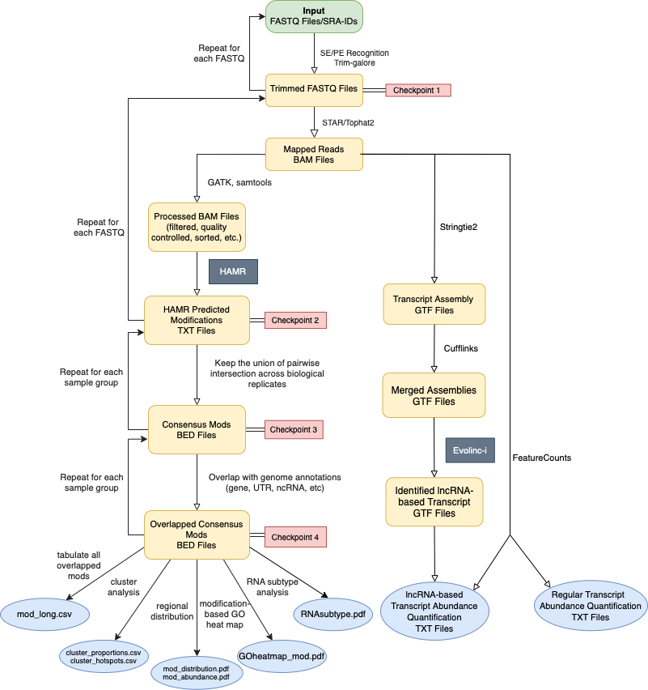

# Homepage

For pipeline code visit [HARMLINC GitHub Repo](https://github.com/chosenobih/HAMRLINC/tree/main).

## Overview
* HAMRLINC is a multipurpose toolbox that expedites the analysis pipeline of two algorithms: [HAMR](https://github.com/GregoryLab/HAMR) and [Evolinc](https://github.com/Evolinc/Evolinc-I/tree/master). The former was developed by [Paul Ryvkin et al](https://rnajournal.cshlp.org/content/19/12/1684), and the latter by [Andrew D.L. Nelson et al](https://www.frontiersin.org/articles/10.3389/fgene.2017.00052/full). HAMRLINC aims to make the original methods more accessible by automating the tedious pre-processing steps, and expand on their functionalities with its built-in post-processing steps, allowing users to perform RNA modification prediction with intuitive output formats, lincRNA identification and transcripts abundance quantifiction using the same RNA-Seq input data.
* HAMRLINC is high-throughput and performs RNA-modification analysis, long intergenic non-coding RNAs(lincRNA) annotation and transcripts abundance quantification at a bioproject scale. HAMRLINC performs constitutive trimming of acquired reads using Trim-Galore, and makes use of STAR (Tophat option available) as the default aligning tool; mapped reads are pre-processed using selected methods from GATK and samtools.
* HAMRLINC is optimized for partial parallel processing, and modularization. Specifying a larger thread count where hardware permits will greatly increase the efficiency of a run. If only partial functionality is needed (e.g. Only analyzing modified ribonucleotides), users can use flags to activate needed function modules as they desire. See below for more details .

## HARMLINC Workflow

<figure markdown>
  { align=left }
  <figcaption>HAMRLINC workflow: Overview of the data flow of HAMRLINC, from input data, which could be raw FASTQ files or list of SRA-IDs to quality control, trimming, mapping, pre-processing and downstream analysis. Pre-processing steps are in yellow, main steps are in grey and, check-points are in peach. </figcaption>
</figure>

